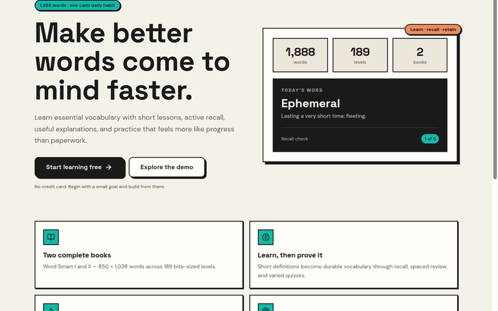

# Word Smartify

> A student-first vocabulary learning PWA for Bangladesh university and IBA admission preparation.

[](https://word-smartify.vercel.app)
[](https://nextjs.org/)
[](https://supabase.com/)
[](https://www.typescriptlang.org/)

<p align="center">
  <a href="https://word-smartify.vercel.app">
    
  </a>
</p>

Word Smartify helps learners build durable English vocabulary through short study sessions, contextual multiple-choice questions, active recall, spaced review, and full mock tests. It is designed around the vocabulary patterns students encounter in Bangladesh admission preparation rather than isolated dictionary memorization.

<p align="center">
  <a href="https://word-smartify.vercel.app">Open Word Smartify</a>
  ·
  <a href="https://word-smartify.vercel.app/iba-english">IBA English preparation</a>
  ·
  <a href="https://github.com/mahinaveiro/word-smartify/issues">Report an issue</a>
</p>

## What the app includes

| Area | What learners can do |
| --- | --- |
| **Learn** | Study vocabulary in focused levels, flip flashcards, and practise immediately with quiz questions. |
| **Question bank** | Work through synonym, antonym, analogy, contextual meaning, fill-in-the-blank, Bangla meaning, recall, and usage questions. |
| **Review** | Revisit saved words, review weak words, and receive mastery-aware practice instead of repeating only familiar items. |
| **Mock tests** | Take timed admission-style tests, review every response, inspect mistakes, and share a result card. |
| **Progress** | Track streaks, daily activity, word mastery, XP, and learning momentum. |
| **Leaderboard** | Compare progress with other learners while keeping the learner’s own rank clearly visible. |
| **Library** | Browse Word Smart 1 and Word Smart 2, search the dictionary, inspect word details, and save words for review. |
| **PWA experience** | Install the app on supported desktop and Android browsers, with an iPhone home-screen guide. |
| **Feedback** | Report a faulty question directly from a quiz so maintainers can investigate it. |

The product prioritises **individual development**: useful practice, clear explanations, deliberate review, and a compact interface that works well on phones.

## Question design

Word Smartify uses several complementary question formats so that recognising a definition is not enough by itself.

- **Synonym and antonym MCQs** test precise semantic relationships.
- **Analogy MCQs** test relationships such as part-to-whole, cause-to-effect, member-to-group, and synonym or antonym pairs.
- **Contextual meaning and fill-in-the-blank questions** test whether a learner can infer meaning from a sentence.
- **Usage questions** ask which sentence uses a word correctly, testing meaning, grammar, collocation, and register.
- **Recall and Bangla meaning questions** support retrieval and bilingual understanding.

Every question carries an explanation intended to teach the distinction, not merely repeat the answer.

## Tech stack

| Layer | Technology |
| --- | --- |
| Framework | Next.js 16.3 with the App Router and Turbopack |
| Language | TypeScript 5.7 |
| UI | React 19, Tailwind CSS 4, Base UI, Lucide icons, Recharts |
| Data and auth | Supabase Auth, Postgres, Row Level Security, and `@supabase/ssr` |
| Email | Resend for question-report and Help & feedback notifications |
| Analytics | Vercel Analytics plus privacy-safe product learning events |
| Deployment | Vercel from the `main` branch |
| Package manager | pnpm 10 |

## Run locally

### Requirements

Use Node.js 22 or a compatible current LTS release, pnpm 10, and a Supabase project containing the Word Smartify schema and seed data.

### Install and start

```bash
pnpm install
pnpm dev
```

Open [http://localhost:3000](http://localhost:3000) in your browser.

### Environment variables

Create `.env.local` at the repository root. Never commit this file or expose server-only values in client code.

| Variable | Required | Used for |
| --- | --- | --- |
| `NEXT_PUBLIC_SUPABASE_URL` | Yes | Supabase project URL used by the browser and server clients. |
| `NEXT_PUBLIC_SUPABASE_PUBLISHABLE_KEY` | Yes | Supabase publishable/anonymous key. |
| `NEXT_PUBLIC_SITE_URL` | Recommended | Canonical site URL and metadata. For production, use `https://word-smartify.vercel.app`. |
| `SUPABASE_SERVICE_ROLE_KEY` | Server-only | Privileged server operations such as authenticated reporting workflows. Never expose it to the browser. |
| `RESEND_API_KEY` | Optional | Sends question-report notifications through Resend. |
| `QUESTION_REPORTS_TO_EMAIL` | Optional | Destination email for question reports and feedback when `FEEDBACK_TO_EMAIL` is not set. |
| `FEEDBACK_TO_EMAIL` | Optional | Destination email for Help & feedback notifications; falls back to `QUESTION_REPORTS_TO_EMAIL`. |
| `RESEND_FROM_EMAIL` | Optional | Sender address for report notifications; the Resend sandbox sender can be used during development. |

A minimal local configuration is enough to run the core app:

```env
NEXT_PUBLIC_SUPABASE_URL=https://your-project.supabase.co
NEXT_PUBLIC_SUPABASE_PUBLISHABLE_KEY=your-publishable-key
NEXT_PUBLIC_SITE_URL=http://localhost:3000
```

## Supabase setup

The live database is authoritative for the application schema. The repository keeps SQL migrations under [`supabase/migrations`](supabase/migrations). Apply migrations through a controlled Supabase workflow and verify the target project before running any destructive operation.

The app expects the main vocabulary and learning tables, including `books`, `chapters`, `levels`, `words`, `quiz_questions`, `profiles`, `user_stats`, `user_word_progress`, `daily_progress`, `mock_tests`, and `mock_test_answers`. Row Level Security is enabled across the public application tables.

For authentication, configure email verification and Google OAuth in the Supabase dashboard. Set the production callback URL to:

```text
https://word-smartify.vercel.app/auth/confirm
```

For local development, also add:

```text
http://localhost:3000/auth/confirm
```

## Useful commands

```bash
pnpm dev       # Start the local development server
pnpm lint      # Run ESLint
pnpm build     # Create a production build
pnpm start     # Serve the production build locally
```

Vercel builds with pnpm. Keep `pnpm-lock.yaml` in sync with `package.json`, and use pnpm 10 when changing dependencies.

## Repository structure

```text
app/              Next.js routes, metadata, auth callbacks, and API routes
components/       Shared shell and UI primitives
features/         Feature-level views for learning, library, quizzes, review, and tests
hooks/            Client hooks for data, actions, and quiz controls
lib/              Shared learning logic, scoring, review scheduling, XP, and utilities
repositories/     Supabase-backed repositories and auth provisioning
services/         Progress, mock-test, and daily-learning services
supabase/         Database migrations
public/           PWA icons, social preview assets, and install screenshots
research/         Maintained integration notes and SQL references
styles/           Global design tokens and application styling where applicable
types/            Database and application TypeScript contracts
```

## Product routes

The public acquisition pages include [`/iba-english`](https://word-smartify.vercel.app/iba-english), [`/word-smart-1`](https://word-smartify.vercel.app/word-smart-1), and [`/word-smart-2`](https://word-smartify.vercel.app/word-smart-2). Authenticated learners use the dashboard, learn flow, library, review drills, mock tests, progress view, profile, settings, and leaderboard.

## Contributing

Keep changes student-first and consistent with the existing visual system. Before opening a pull request, run `pnpm lint` and `pnpm build`. Do not commit environment files, generated build metadata, Supabase service-role credentials, or temporary audit notes. Database changes should be discussed first, written as explicit migrations, and checked against the live schema before deployment.

Bug reports are welcome through [GitHub Issues](https://github.com/mahinaveiro/word-smartify/issues). Include the route, steps to reproduce, expected behaviour, actual behaviour, and relevant browser or device details. For a faulty quiz question, use the in-app report action when possible so the question ID and word context are retained.

## License

The repository does not currently declare a separate open-source license. Treat it as **all rights reserved** unless the repository owner adds a license file.
